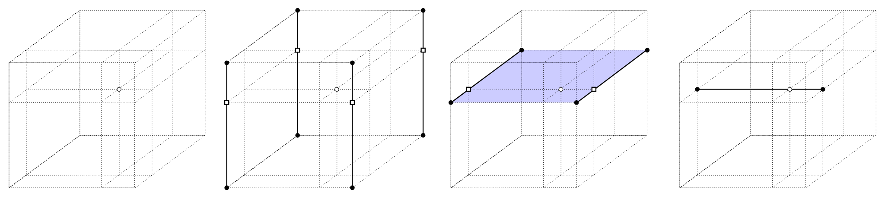
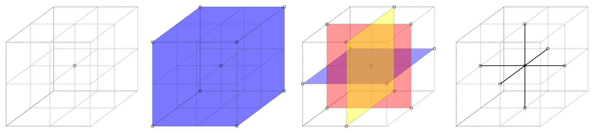
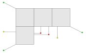

# ndpolator

Ndpolator is a module for multi-dimensional linear interpolation, extrapolation, imputation and blending.

## General principles of interpolation

Linear $N$-dimensional interpolation is a frequently used method for evaluating function values on a grid. The algorithm implemented in ndpolator is 
optimized for generality and speed. Given a sequence of axes (a 3D example is depicted below), interpolation successively reduces the number of 
dimensions in which it interpolates. It starts with the corners of the $N$-dimensional hypercube (solid circles) to obtain interpolated values (open 
squares) in the $(N-1)$-dimensional hyperplane while keeping the *last* axis constant ($z$-axis in the figure below). It then removes the last axis and 
forms an $(N-1)$-dimensional hypercube from the interpolated vertices. The process is then repeated until the dimension is reduced to 0 and the 
interpolated value in the point of interest is obtained (open circle).



Note that the choice of interpolating along the *last* axis is both arbitrary (we could just as easily have chosen any other axis) and general (we could pivot the axes if another interpolation sequence is desired). For as long as the parameter space is sufficiently linear, the choice of the sequence for axis elimination is not too important, but any local non-linearity will cause the sequence to matter.

The algorithm takes a point of interest (or an array of points of interest) `x` (open circle), an $N$-dimensional vector `lo` of the lowest (inferior) corner of the hypercube spun by the axes, an $N$-dimensional vector `hi` of the highest (superior) corner of the spun hypercube, and an array of $2^N$ function values `fv` sorted by vertices (hypercube corners) in the following sequence:

$$ fv = \left[
\begin{matrix}
f(x_{1,\mathrm{lo}}, x_{2,\mathrm{lo}}, \dots, x_{N,\mathrm{lo}}) \\
f(x_{1,\mathrm{hi}}, x_{2,\mathrm{lo}}, \dots, x_{N,\mathrm{lo}}) \\
f(x_{1,\mathrm{lo}}, x_{2,\mathrm{hi}}, \dots, x_{N,\mathrm{lo}}) \\
f(x_{1,\mathrm{hi}}, x_{2,\mathrm{hi}}, \dots, x_{N,\mathrm{lo}}) \\
\vdots \\
f(x_{1,\mathrm{hi}}, x_{2,\mathrm{hi}}, \dots, x_{N,\mathrm{hi}}) \\
\end{matrix}
\right] $$

where $x_k$ are axis values for the $k$-th axis. Interpolation proceeds from the last axis to the first. The algorithm first forms an auxiliary $2^N \times N$ matrix `n`:

$$
n_{ji} = \mathrm{lo}_i + (\mathrm{hi}_i-\mathrm{lo}_i) \times \mathrm{mod} (j \div 2^i, 2),
$$

where $\div$ denotes integer division and $\mathrm{mod}(x, y)$ is the modulo operator, i.e. the remainder of the integer division $x/y$. Interpolation is then done by sequentially reducing dimension $N$ of the interpolating grid:

$$
fv_j \mapsto fv_j + \frac{x_{N-i} - n_{j,N-i}}{n_{j+2^{N-i},N-i}-n_{j,N-i}} (fv_{j+2^{N-i}}-fv_{j}) \quad \textrm{for } i=1 \dots N.
$$

Once $i=0$, we are left with a single $fv$ vertex, $fv_0$, that holds the interpolated value. Note that array $fv$ is modified in the process, so we need to pass a copy of the grid if original values are required for other purposes.

As an example for setting up the ndpolator, consider a 2-D grid with the following coordinates and function values:

$$
(0, 0) = 1, \quad (0, 1) = 2, \quad (1, 0) = 3, \quad (1, 1) = 4.
$$

First we need to form `lo` and `hi` arrays:

$$
\mathrm{lo} = [0, 0], \quad \mathrm{hi} = [1, 1].
$$

Then we need to form the array of function values:

$$
fv = \left[
    \begin{matrix}
        f(0, 0) \\
        f(1, 0) \\
        f(0, 1) \\
        f(1, 1) \\
    \end{matrix}
\right] = \left[
    \begin{matrix}
        1 \\ 3 \\ 2 \\ 4 \\
    \end{matrix}
\right]
$$

We would then pass to ndpolator a point of interest `x`, say $(0.3, 0.8)$, `lo`, `hi` and `fv` arrays. In code:

```
>>> import ndpolator
>>> x = [0.3, 0.8]
>>> lo = [0, 0]
>>> hi = [1, 1]
>>> fv = [1, 3, 2, 4]
>>> ndpolator.ndpolate(x, lo, hi, fv)
2.4
>>> fv
[2.4, 3.8, 2, 4]
```

## General principles of imputation

Imputation of missing values has a long history in data science and [many approaches have been proposed](https://towardsdatascience.com/6-different-ways-to-compensate-for-missing-values-data-imputation-with-examples-6022d9ca0779), either general or specific to the problem at hand. In our case we devised an imputation method that relies on several assumptions:

* the shape of the parameter space is locally linear to the extent that linear interpolation is adequate within the model uncertainties;
* the definition range of grid should not be extended past the original axis spans; and
* off-grid values should be smoothly "ramped" to (or blended with) an underlying fallback grid or a theoretical model.

Consider an $N$-dimensional hypercube spun by a set of $N$ axes (a 3D example is depicted in the figure below). Let the central point be the imputation vertex (i.e., an undefined value that we want to impute). Other vertices can either either have associated values or be undefined themselves. In general, there are $3^N-1$ bounding vertices (so 26 in 3D).



If all bounding vertex values are defined, then there are $N \choose D$ combinations to interpolate in $D$-dimensional subspace. In 3D, there is 1 combination in 3D, 3 combinations in 2D, and 3 combinations in 1D (cf. the figure above). If there are any undefined values in the grid, combinations that rely on those values cannot be used for imputation.

If the grid were truly linear, then it would not matter along which direction we interpolate -- all directions would yield the same answer. If, however, the parameter space is non-linear, then each interpolated direction will yield a different result. The imputed value can only be a single estimate, of course; in principle we would need to evaluate a local curvature but that would violate our linearity assumption. Because of that, we join individual values either by taking a simple mean, or by first averaging them per dimension of the subspace (i.e., over $N \choose D$ combinations), and then evaluating the mean. When imputing, ndpolator implements a function that returns an array of all interpolants, so the calling function can apply any weighting scheme that is suitable for the problem at hand.

<!-- 
The order of directions is determined by the `mask` parameter. It flags the axes that are "in use". For example, for a 3D grid, the sequence is:

$$ [1, 1, 1], [0, 1, 1], [1, 0, 1], [1, 1, 0], [0, 0, 1], [0, 1, 0], [1, 0, 0]. $$

### Application to model atmospheres

Atmosphere grids provide emergent specific intensity of light as a function of atmospheric parameters (Teff, logg, heavy metal abundance, micro- and macro-turbulence, rotational and revolutional radial velocity, ...). These are computed by the model atmosphere codes in (usually) regularly spaced grids of parameters. While some combinations of parameters are not physical, there can be combinations of parameters that *are* physical but that model atmospheres fail to converge. As computing atmospheric models is outside of PHOEBE's realm, we rely on other works to provide the atmosphere grids for us. When these grids feature combinations of parameters that are physical but that do not come with a corresponding emergent specific intensity, we need to *impute* them: replace the non-existent values with their *estimates* from values that are available.
-->

## General principles of blending

The two well defined regimes for linearly interpolating values on an n-D grid are (1) when the points of interest fall within the grid, and (2) when the points of interest fall well outside the grid. In the first case we linearly interpolate (in $N$ dimensions) on the grid, and in the second case we fall back on the underlying grid or a theoretical model.

<!-- In the latter case we have to deal with one additional complication: limb darkening. Blackbody radiation, by virtue of emergent angle invariance, is not limb-darkened, while stars of course are. That is why the normal emergent passband intensity at a given temperature $T_\mathrm{eff}$ has to be corrected by the integrated limb darkening:

$$ \mathcal L_\mathrm{int} = \int_0^1 \mathcal L(\mu) d\mu, $$

where $\mathcal L(\mu)$ is the limb darkening function and $\mu \equiv \cos \theta$ is the emergent angle. The normal emergent blackbody intensity is then:

$$ B_\mathrm{norm}(\lambda) \mapsto \frac{B_\mathrm{norm}(\lambda)}{\mathcal{L}_\mathrm{int}}. $$

The problem lies in the dependence of $\mathcal L_\mathrm{int}$ on temperature by way of limb darkening coefficients for the given $\mathcal L(\mu)$. When atmospheric parameters are on-grid, $\mathcal L_\mathrm{int}$ is easy to interpolate, but when they are off-grid, $\mathcal L_\mathrm{int}$ needs to be extrapolated. In the vicinity of the grid an $N$-D extrapolation is likely acceptable, but farther from the grid the extrapolated value becomes increasingly unreliable and we are likely better off adopting the _nearest_ value of $\mathcal L_\mathrm{int}$ on the grid instead. -->

When the points of interest are off the grid but _close_, neither of the above regimes is applicable. If we assumed the underlying grid value, we would introduce a discontinuous jump in grid values every time we wander off the grid, which is of course not desired. Instead, this region should "blend" the default grid with the underlying grid as smoothly as possible.

It is worth noting that, while blending provides a smooth transition between the grids, it does _not_ provide any insight into the behavior off-grid. While it is certainly better than a discrete jump, expanding the default grid is the only valid way to extend the applicability of n-D interpolation.

### Blending region

Grid axes will in general correspond to some physical quantity having some given physical units, so it is impractical to define the blending region in relative terms; for example, 1% in one parameter and 1% in another can be vastly disproportionate. To handle that, we remap the axes using `ndpolator.map_to_cube()` so that the blending region can be controlled by a single parameter (i.e., the extent beyond the grid boundary). Given the blending region, the axes will be (possibly non-linearly) rescaled so that the blending region corresponds to 1 unit along each axis.

### The blending function

The smoothness of the on-grid to off-grid transition will depend on several factors:

* similarity of the default and fallback grid values at the edge;
* reliability of extrapolating default grid values; and
* the choice of the blending function and its extent (i.e., how fast will the extrapolated grid values be blended with the fallback values).

The first two factors are largely out of our control; the last factor, on the other hand, is. The principal parameter that determines blending is _distance from the grid_; given a point of interest $\mathbf v$ and distance $d$, the blending function provides a prescription on how to mix the extrapolated grid value and fallback grid value at point $\mathbf v$:

$$ y_\mathrm{blend} (\mathbf v) = \alpha(d) \, y_\mathrm{def} (\mathbf v) + [1 - \alpha(d)] \, I_\mathrm{fb} (\mathrm{v}), $$

where $\alpha(d)$ is the blending parameter. The simplest prescription for $\alpha(d)$ might be a simple linear ramp:

$$ \alpha (d) = 1 - \tau d, $$

where $\tau$ controls the slope. A slightly more complicated prescription is a sigmoid ramp:

$$ \alpha (d) = 1 - \left( 1 + e^{-\tau (d-\delta)} \right)^{-1}, $$

where $\tau$ and $\delta$ control sigmoid steepness and offset, respectively.

<!-- It is important to note that there is _nothing fundamenally physical_ about the choice of the blending function: we _know_ that blackbody intensities are a poor approximation for stars, and we _know_ that model atmosphere validity deteriorates towards the edge of the definition range; how we blend the two values that we _know_ are wrong is of little practical consequence, for as long as the transition is smooth and the model does not feature a significant number of blended surface elements. Blending is meant only and exclusively to enable us to use model atmospheres for the majority of the star when a handful of surface elements' atmospheric parameters fall off the grid, such as the nose of a semi-detached binary, or a spike in reflection, or close-to-critically spinning stars. -->

### Extrapolate from the grid or adopt the value from the nearest neighbor?

As mentioned above, extrapolation becomes progressively more inaccurate as the distance from the grid increases. In those cases it is likely better to adopt the nearest neighbor value: while demonstrably incorrect, it is almost certainly *less* incorrect than unbound extrapolation. Thus, we need to work out a fast and efficient lookup of the nearest neighbor value.

To that end we employ [k-D trees](https://en.wikipedia.org/wiki/K-d_tree). The algorithm is implemented in scipy; it partitions the data in a way that allows a binary search for the nearest neighbor. To create the search tree, we first identify all non-null vertices and then initialize the tree.

### Computing the blended values

Blended values can in general be written as:

$$ y_\mathrm{blend} (\mathbf v) = 
\begin{cases}
y_\mathrm{def} (\mathbf v) & \textrm{default grid region} \\
\alpha y_\mathrm{def} (\mathbf v) + (1-\alpha) y_\mathrm{fb} (\mathbf v) & \textrm{blending region} \\
y_\mathrm{fb} (\mathbf v) & \textrm{fallback region} \\
\end{cases} $$

Once we have the blending region and the blending function defined, we can proceed with blending itself. The overall sequence of steps for blending is:

* remap the point of interest, $\mathbf v$, to uniform axes;
* among all hypercubes on the grid, find those that are fully defined (i.e., all corresponding intensities are defined and finite) and adjacent to $\mathbf v$;
* for each hypercube:
  * interpolate/calculate fallback grid value;
  * extrapolate the value of $y_\mathrm{def} (\mathbf v)$ from the default grid;
  * calculate the distance vector $\mathbf d$ between $\mathbf v$ and the nearest vertex of the hypercube;
  * project the distance vector onto the normal to the nearest grid surface and calculate $d = \mathbf d \cdot \mathbf {\hat n}$;
  * calculate:
    $$
    y_\mathrm{blend}(\mathbf v) = \begin{cases} y_\mathrm{def} (\mathbf v) & \textrm{ for } d<0; \\ \alpha y_\mathrm{def}(\mathbf v) + (1-\alpha) y_\mathrm{fb}(\mathbf v) & \textrm{ for } 0 \leq d \leq 1; \\ y_\mathrm{fb}(\mathbf v) & \textrm{ for } d > 1. \\ \end{cases}
    $$
    Here $\alpha(d)$ is the blending parameter defined above;
* average $y_\mathrm{blend}(\mathbf v)$ from all hypercubes into the single value.

The figure below depicts the calculation of the distance vector based on the position of the point of interest; if the nearest part of the grid is a vertex, then the distance is a simple eucledian distance to that vertex (depicted in green); if the nearest part is a face, then the distance vector needs to be projected onto that face (depicted in yellow); if there are multiple fully defined nearby faces, then the distance vector to each face determines one extrapolated value and averaging is needed (depicted in red).



For compute time efficiency, it proves useful to assemble an array of inferior corners of fully defined hypercubes across the entire grid ahead of time; ndpolator uses this array to lookup the nearest fully defined hypercube (or a set of hypercubes) for each vector that is off-grid.
